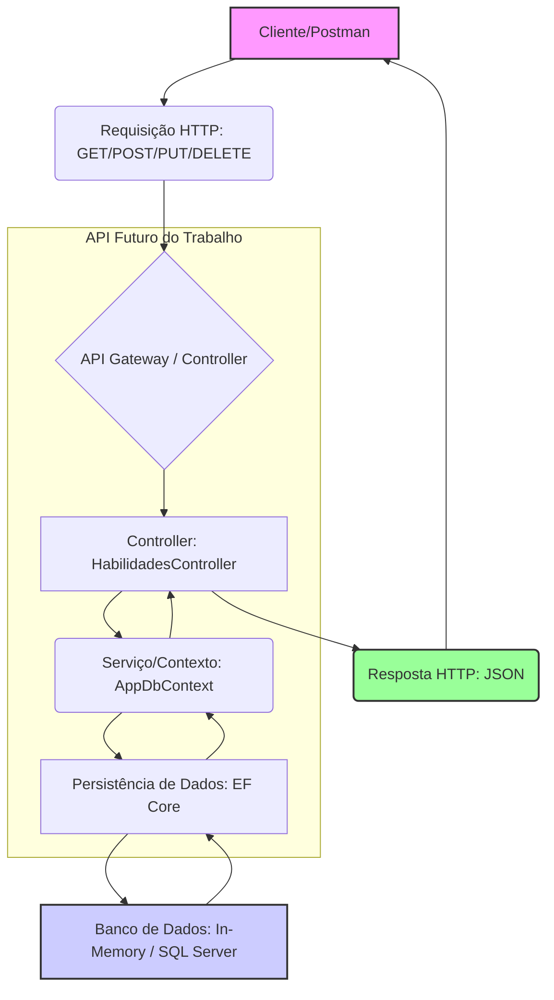

# Futuro do Trabalho API - Gerenciamento de Habilidades

Este projeto consiste em uma Web API desenvolvida em **ASP.NET Core 8** para o gerenciamento de habilidades (Skills Management), um tema central no "Futuro do Trabalho". A aplicação foi desenvolvida seguindo rigorosamente as boas práticas de API RESTful, versionamento e documentação, utilizando **Entity Framework Core** para persistência de dados.

## 1. Integrantes

*   [Seu Nome Completo] - [Seu RA]
*   [Nome do Integrante 2] - [RA do Integrante 2] (Opcional)
*   [Nome do Integrante 3] - [RA do Integrante 3] (Opcional)

## 2. Documentação e Requisitos Atendidos

| Requisito | Status | Detalhes da Implementação |
| :--- | :--- | :--- |
| **Boas Práticas (30 pts)** | ✅ Concluído | Uso de `[ApiController]`, `ControllerBase`, verbos HTTP corretos (GET, POST, PUT, DELETE) e códigos de status HTTP adequados (200 OK, 201 Created, 204 No Content, 400 Bad Request, 404 Not Found). |
| **Versionamento da API (10 pts)** | ✅ Concluído | A API está versionada com o prefixo `/api/v1/` na rota do Controller (`[Route("api/v1/[controller]")]`). |
| **Integração e Persistência (30 pts)** | ✅ Concluído | Utilização do **Entity Framework Core** com um `DbContext` e persistência de dados em memória (`InMemoryDatabase`) para facilitar a execução e demonstração. A estrutura está pronta para migração para SQL Server. |
| **Documentação Swagger (30 pts)** | ✅ Concluído | Implementação completa do **Swagger/OpenAPI** com comentários XML para documentar endpoints, parâmetros e modelos de retorno. |
| **Documentação no README** | ✅ Concluído | Este documento atende ao requisito de documentação completa. |
| **Fluxo da Aplicação (Draw.io)** | ✅ Concluído | O diagrama de fluxo de dados está detalhado na seção 5. |
| **Link do Vídeo** | ⏳ Pendente | [INSERIR LINK DO VÍDEO AQUI] |

## 3. Funcionalidades (CRUD de Habilidades)

A API oferece um conjunto completo de operações CRUD (Create, Read, Update, Delete) para a entidade `Habilidade`.

| Verbo HTTP | Rota | Descrição | Status Codes de Sucesso |
| :--- | :--- | :--- | :--- |
| **GET** | `/api/v1/habilidades` | Lista todas as habilidades cadastradas. | 200 OK |
| **GET** | `/api/v1/habilidades/{id}` | Busca uma habilidade específica pelo ID. | 200 OK, 404 Not Found |
| **POST** | `/api/v1/habilidades` | Cria uma nova habilidade. | 201 Created, 400 Bad Request |
| **PUT** | `/api/v1/habilidades/{id}` | Atualiza uma habilidade existente. | 204 No Content, 400 Bad Request, 404 Not Found |
| **DELETE** | `/api/v1/habilidades/{id}` | Exclui uma habilidade. | 204 No Content, 404 Not Found |

**Modelo de Dados (`Habilidade`)**

| Campo | Tipo | Descrição |
| :--- | :--- | :--- |
| `Id` | `int` | Chave primária. |
| `Nome` | `string` | Nome da habilidade (ex: "Pensamento Crítico"). |
| `Descricao` | `string` | Descrição detalhada da habilidade. |
| `Tipo` | `string` | Classificação (ex: "Hard Skill" ou "Soft Skill"). |

## 4. Forma de Funcionamento (Como Rodar)

A aplicação utiliza o .NET 8 e pode ser executada em qualquer ambiente com o SDK instalado.

1.  **Pré-requisitos:**
    *   .NET SDK 8.0 ou superior.
2.  **Clonar o Repositório:**
    ```bash
    git clone [LINK DO SEU REPOSITÓRIO]
    cd FuturoTrabalhoApi
    ```
3.  **Executar a Aplicação:**
    ```bash
    dotnet run
    ```
    A API será iniciada, geralmente na porta `https://localhost:7042` (verifique o console).
4.  **Acessar o Swagger:**
    Abra o navegador e acesse a URL do Swagger para testar os endpoints:
    `https://localhost:7042/swagger/index.html` (A porta pode variar).

## 5. Fluxo de Dados (Diagrama Draw.io)

O diagrama abaixo ilustra o fluxo de uma requisição na API, desde o cliente até a persistência dos dados.

**Instrução:** Você deve desenhar este fluxo no Draw.io e salvar a imagem no repositório.



## 6. Link do Vídeo

[INSERIR LINK DO VÍDEO AQUI]
