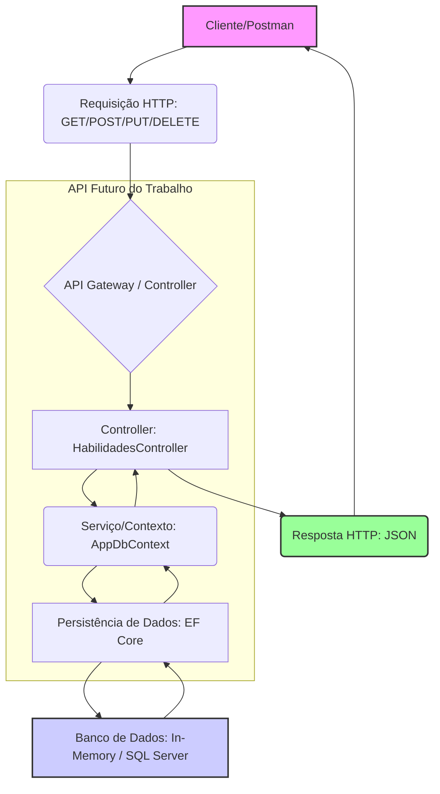

## Diagrama de Fluxo de Dados (Draw.io)

O diagrama abaixo representa o fluxo de dados da aplicação, desde a requisição do cliente até a persistência no banco de dados.

**Instrução para o Aluno:** Você pode usar o código Mermaid acima em ferramentas que o suportam (como o GitHub) ou, para atender ao requisito do professor, desenhar o fluxo no [Draw.io](https://app.diagrams.net/) e salvar a imagem no repositório.
